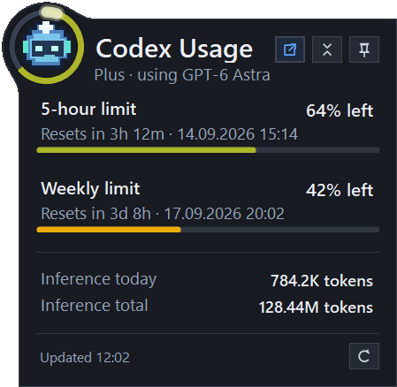
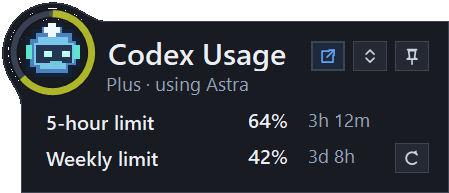
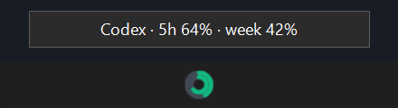
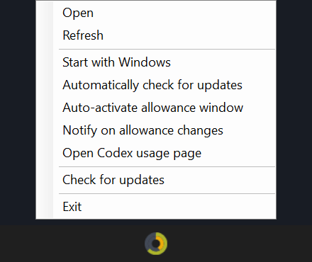

# Codex Usage Tray

[](https://github.com/MatthiasHeinsius/codex-usage-tray/actions/workflows/build.yml)

Codex Usage Tray is a small Windows tray app. It displays Codex usage for the ChatGPT account signed in through the Codex CLI.

This is an unofficial community project. It is not affiliated with OpenAI.

## What it shows

- Remaining 5-hour allowance and its reset time
- Remaining weekly allowance and its reset time
- Inference tokens used today
- Total inference tokens reported for the account
- Live countdowns in a compact view

The tray icon has two rings. The outer ring shows the 5-hour allowance. The inner ring shows the weekly allowance. The rings and extended-view bars change color continuously from green at 100% remaining through yellow near 50%, orange at 25%, and red at 10%. The app refreshes the limits and countdowns once a minute. It refreshes daily and lifetime activity when you open or switch to the extended view.

## Screenshots

### Extended view



### Compact view



Pin either view to move it. Drag the popup by its background or text. It can cross the taskbar and snaps flush or with an eight-pixel gap to every screen edge and the top of the taskbar.

### Tray icon

Hover over the tray icon to see both remaining percentages.



Right-click the tray icon to open the app menu.



## Requirements

- 64-bit Windows 10 or Windows 11
- Codex CLI installed and signed in with your ChatGPT account

The portable release includes the .NET desktop runtime. It does not require a separate .NET installation or administrator access.

## Install

Download [`CodexUsageTray.exe`](https://github.com/MatthiasHeinsius/codex-usage-tray/releases/latest/download/CodexUsageTray.exe) from the [latest GitHub release](https://github.com/MatthiasHeinsius/codex-usage-tray/releases/latest). Move it to a permanent location, then run it. You can also build the executable from source.

Left-click the tray icon to open or close the usage window. A double-click performs the same toggle once. Right-click the icon to refresh the data, change startup settings, check for updates, open the Codex usage page, or exit.

`Automatically check for updates` is off by default and appears directly below `Start with Windows` in the tray menu. Enable it to check GitHub when the app starts. Use `Check for updates` to run a check manually.

When either check finds a newer release, the app asks before downloading or installing it. If you accept, the app downloads `CodexUsageTray.exe`, verifies it against the release's `SHA256SUMS.txt`, replaces the executable in its current folder, and restarts. Windows asks for administrator access only if the executable is in a protected location. A manual check reports when the installed version is current or the check fails. Startup checks stay silent when no update is available or GitHub cannot be reached.

`Start with Windows`, `Auto-activate allowance window`, and `Notify on allowance changes` are off on first launch. `Start with Windows` creates a shortcut that appears in Windows Startup Apps. Keep the executable at the same path after enabling this setting because the shortcut points to that file.

The executable is not code-signed, so Windows SmartScreen or antivirus software may warn about it.

## Features

Use the view button to switch between compact and extended modes. Compact mode shows each allowance and its countdown. Extended mode adds reset times, progress bars, and inference totals.

The pin button keeps the popup open and above other windows. While pinned, drag the background or text to move it. The popup snaps either flush with the screen and taskbar edges or with an eight-pixel gap. A pinned popup keeps its position when hidden. An unpinned popup opens next to the tray.

`Auto-activate allowance window` activates a 5-hour or weekly allowance that has 100% remaining by sending an ephemeral `Hi` request with GPT-5.6 Luna. This request consumes Codex inference. The app confirms activation when the allowance reset time changes on a later one-minute refresh. It makes one initial request and up to three retries for each activation. A used-up allowance waits for its reset; other command failures retry after five minutes. Retry counts reset when the application restarts.

`Notify on allowance changes` reports when an allowance becomes used up and when it resets. Notifications are off by default, combine simultaneous 5-hour and weekly events, and do not repeat when the application starts or retries an activation.

## Usage data and privacy

The app runs the installed Codex CLI in app-server mode and calls its read-only account methods. It does not directly read, copy, or store credentials from `%USERPROFILE%\.codex\auth.json`.

The account service may publish daily token buckets a day late. If today's bucket is missing, the app totals `token_usage_record` entries from the local Codex session history. If the account total ends with yesterday's data, the app adds today's local total to the displayed inference total. Routine allowance refreshes retain same-day activity and its original observation time. On a new local date, today's retained activity clears while the lifetime total remains available with its observation time.

The app does not upload the usage data it reads from the account or local history. Update checks contact the GitHub releases API and download release files from GitHub when needed. The optional auto-activation feature only sends the `Hi` request described above.

The app stores its view and window-start settings under `HKEY_CURRENT_USER\Software\CodexUsageTray`. The optional Windows startup shortcut is in the current user's Startup folder.

## Build from source

Install the [.NET 10 SDK](https://dotnet.microsoft.com/download/dotnet/10.0), then run:

```powershell
dotnet build .\CodexUsageTray.slnx -c Release
dotnet test .\tests\CodexUsageTray.Tests\CodexUsageTray.Tests.csproj -c Release --no-build
dotnet run --project .\src\CodexUsageTray\CodexUsageTray.csproj -c Release --no-build -- --self-test
```

To create the self-contained Windows x64 executable, double-click `build-release.cmd` or run:

```powershell
dotnet publish .\src\CodexUsageTray\CodexUsageTray.csproj `
  -c Release `
  -r win-x64 `
  --self-contained true `
  -p:PublishSingleFile=true `
  -p:DebugType=None `
  -p:DebugSymbols=false `
  -o .\artifacts\win-x64
```

If Codex is installed somewhere unusual, set `CODEX_USAGE_CODEX_PATH` to the full path of `codex.cmd` or `codex.exe` before starting the app.

The repository includes an asset generator for maintainers. It uses synthetic figures and does not read account data:

```powershell
dotnet run --project .\tools\CodexUsageTray.ScreenshotGenerator -- .\docs\images
dotnet run --project .\tools\CodexUsageTray.ScreenshotGenerator -- --app-icon .\src\CodexUsageTray\Assets\CodexUsageTray.ico
```

## Current limitation

The Codex app-server marks the account usage method as experimental. A future Codex CLI release may change it. If that happens, the app reports the error instead of estimating the missing figure.

## License

Codex Usage Tray is available under the [MIT License](LICENSE).
