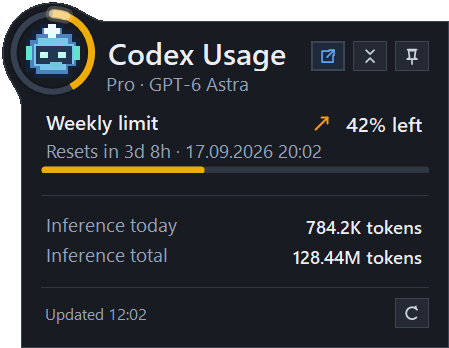

# Codex Usage Tray

[](https://github.com/MatthiasHeinsius/codex-usage-tray/actions/workflows/build.yml)

Codex Usage Tray is a small Windows tray app. It displays Codex usage for the ChatGPT account signed in through the Codex CLI.

This is an unofficial community project. It is not affiliated with OpenAI.

## What it shows

- Remaining 5-hour and weekly allowances reported for the account, with their reset times
- Whether each allowance is being used faster or slower than its window passes
- The signed-in subscription, active Codex model, and recent inference activity
- Inference tokens used today
- Total inference tokens reported for the account
- Live countdowns in a compact view

The tray icon uses an outer ring for the 5-hour allowance and an inner ring for the weekly allowance. When the account reports only one allowance, that allowance uses a single outer ring. The popup omits allowances the account does not report and resizes to fit. The rings and extended-view bars change color continuously from green at 100% remaining through yellow near 50%, orange at 25%, and red at 10%. The app refreshes the limits and countdowns once a minute. It refreshes daily and lifetime activity when you open or switch to the extended view.

The icon beside each allowance compares its used percentage with the percentage of the window that has elapsed. An orange up arrow means use is more than five percentage points ahead of time; a green down arrow means it is more than five points behind. A gray right arrow means the difference is within five points. A clock appears when the reset time has passed. The icon is hidden when there is not enough information to compare pace. Hover over it for a description.

The popup's pixel-art indicator shows Luna, Terra, Sol, or Astra when it can identify the active model from local Codex session logs. Its ring rotates at a speed based on allowance use relative to elapsed time, including while Codex is idle. A separate glow shows recent token activity and fades over 15 seconds. When the allowance reaches zero, the ring shows a repeating red flash. During the final 15 minutes before reset, a double flash in the green used for a full ring takes priority. After reset, it flashes cyan until the new window is activated and for five minutes afterward. The account line shows the subscription with the active model and its version, such as `GPT-6 Astra`, or `idle` in both views.

The indicator clears its visual reset and activation history when the displayed allowance switches between five-hour and weekly, or disappears. Loading and failed refreshes retain the history of the allowance still on display.

## Screenshots

### Extended view


### Compact view


### Account with only a weekly allowance

When the account does not report a 5-hour allowance, the popup omits that section and resizes to fit.



Pin either view to move it. Drag the popup by its outer border or circular activity indicator. It can cross the taskbar and snaps flush or with an eight-pixel gap to every screen edge and the top of the taskbar.

### Tray icon

Hover over the tray icon to see both remaining percentages.


Right-click the tray icon to open the app menu.


## Requirements

- 64-bit Windows 10 or Windows 11
- Codex CLI installed and signed in with your ChatGPT account

The portable release includes the .NET desktop runtime. It does not require a separate .NET installation or administrator access.

If the cached Codex sign-in expires, the tray first asks Codex to refresh it. If that fails, the tray explains the problem and asks before opening the official ChatGPT sign-in page. If browser sign-in cannot finish, run `codex logout` and then `codex login` in a terminal before refreshing again.

## Install

Download [`CodexUsageTray.exe`](https://github.com/MatthiasHeinsius/codex-usage-tray/releases/latest/download/CodexUsageTray.exe) from the [latest GitHub release](https://github.com/MatthiasHeinsius/codex-usage-tray/releases/latest). Move it to a permanent location, then run it. You can also build the executable from source.

Left-click the tray icon to open or close the usage window. A double-click performs the same toggle once. Right-click the icon to refresh the data, change startup settings, check for updates, open the Codex usage page or project README, read the licenses and notices, or exit.

`Check for updates on startup` is off by default and appears directly below `Start with Windows` in the tray menu. Enable it to check GitHub when the app starts. Use `Check for updates` to run a check manually.

When either check finds a newer release, the app asks before downloading or installing it. If you accept, the app downloads `CodexUsageTray.exe`, verifies it against the release's `SHA256SUMS.txt`, replaces the executable in its current folder, and restarts. Windows asks for administrator access only if the executable is in a protected location. A manual check reports when the installed version is current or the check fails. Startup checks stay silent when no update is available or GitHub cannot be reached.

The download and checksum verification share a 60-second deadline. If the download stalls or fails, the app removes the partial file and lets you try again. The installer carries the release checksum through the helper and administrator handoff, checks the executable before copying or starting it, and blocks changes to those files while they are in use.

`Start with Windows`, `Auto-start allowance window`, and `Notify on allowance changes` are off on first launch. `Start with Windows` creates a shortcut that appears in Windows Startup Apps. Keep the executable at the same path after enabling this setting because the shortcut points to that file.

The executable is not code-signed, so Windows SmartScreen or antivirus software may warn about it.

### Verify a download

Releases from v1.5.5 onward include a GitHub build-provenance attestation. With the GitHub CLI installed, verify a downloaded executable before running it:

```powershell
gh attestation verify .\CodexUsageTray.exe `
  --repo MatthiasHeinsius/codex-usage-tray `
  --signer-workflow MatthiasHeinsius/codex-usage-tray/.github/workflows/release.yml
```

To require a particular release tag, also pass `--source-ref refs/tags/vX.Y.Z` with the version you downloaded. Releases up to and including v1.5.2 predate build attestations. For immutable releases, use `gh release verify-asset vX.Y.Z .\CodexUsageTray.exe --repo MatthiasHeinsius/codex-usage-tray` to verify the file against the published release. Build provenance identifies the source and workflow that produced the executable; it does not provide a Windows code-signing certificate. The application's updater currently verifies SHA-256 checksums, not attestations.

## Features

Use the view button to switch between compact and extended modes. Compact mode shows each reported allowance and its countdown. Extended mode adds reset times, progress bars, and inference totals.

The pin button keeps the popup open and above other windows. While pinned, drag the popup by its outer border or the circular activity indicator to move it. The popup snaps either flush with the screen and taskbar edges or with an eight-pixel gap. A pinned popup keeps its position when hidden. An unpinned popup opens next to the tray.

`Auto-start allowance window` activates a 5-hour or weekly allowance that has 100% remaining by sending an ephemeral `Hi` request with GPT-5.6 Luna. This request consumes Codex inference. The app sends it only when every reported allowance has some capacity left. The app confirms activation when the allowance reset time changes on a later one-minute refresh. It makes one initial request and up to three retries for each activation. A used-up allowance waits for its reset; other command failures retry after five minutes. Retry counts reset when the application restarts.

`Notify on allowance changes` reports when an allowance becomes used up and when it resets. Notifications are off by default, combine simultaneous 5-hour and weekly events, and do not repeat when the application starts or retries an activation.

## Usage data and privacy

The app runs the installed Codex CLI in app-server mode to read account usage and the signed-in account email. If the sign-in expires, it can ask Codex to refresh the session and, after confirmation, start ChatGPT browser sign-in. It does not directly read, copy, or store credentials from `%USERPROFILE%\.codex\auth.json`.

The activity indicator watches recent files in `%USERPROFILE%\.codex\sessions` and `%USERPROFILE%\.codex\archived_sessions` for token activity and model names. Files elsewhere under `.codex` do not supply activity. At startup, it considers files modified within the last two days, reading newest first until it finds 12 sessions with eligible token activity or runs out of candidates. It ignores internal `codex-auto-review` sessions when choosing the active model and activity state; review-only and tokenless files do not count toward the startup limit. This filter does not change inference totals. It reads these files locally and does not change them.

When first observing a session, the indicator reads its complete records from the start in the background so earlier model metadata remains available even in large logs without delaying the popup. Later reads resume after the last complete record, checking that record still matches before reusing the saved position. Each pending batch publishes only the final activity, after model identification and review-session filtering.

The account service may publish daily token buckets a day late. If today's bucket is missing, the app totals `token_usage_record` entries from the local Codex session history. If the account total ends with yesterday's data, the app adds today's local total to the displayed inference total. Routine allowance refreshes retain activity only while the signed-in account email remains the same. If the email changes or is unavailable, retained token figures clear until the next activity read. On a new local date, today's retained activity clears while the lifetime total remains available with its observation time.

A detected account change also resets pending allowance activation attempts and the allowance transition baseline, so the new account's first refresh does not produce a notification based on the previous account.

The app does not upload the usage data it reads from the account or local history. Update checks contact the GitHub releases API and download release files from GitHub when needed. The optional auto-activation feature only sends the `Hi` request described above.

Local history reads process complete records in chunks and retain unfinished records for the next refresh. Malformed records and invalid token counts are ignored. If a local total exceeds the supported integer range, account data remains available without that local total. Canceled or interrupted reads can retry without skipping or counting records twice.

The app stores its view, update, allowance activation, and notification preferences under `HKEY_CURRENT_USER\Software\CodexUsageTray`. The optional Windows startup shortcut is in the current user's Startup folder.

If Windows denies access to saved preferences, the app uses the first-launch defaults. A blocked popup-view save still lets you change views for the current session. Other preference changes report save failures and restore the previous menu checkmark.

## Build from source

Install the [.NET SDK](https://dotnet.microsoft.com/download) version pinned in [`global.json`](global.json). SDK roll-forward is disabled, so another SDK version alone is insufficient. Then run:

```powershell
dotnet build .\CodexUsageTray.slnx -c Release
dotnet test --solution .\CodexUsageTray.slnx -c Release --no-build
```

To see a one-minute demo of the allowance lifecycle in the actual indicator, run:

```powershell
.\src\CodexUsageTray\bin\Release\net10.0-windows\CodexUsageTray.exe --demo
```

The demo uses sample allowance data and repeats two 30-second runs. A fast burn reaches zero; a slower burn resets with 60% remaining. Each run shows the final 15 minutes before reset, the reset, activation, and the end of the cyan flash. It opens separately from the tray app.

The test project uses xUnit.net 4 and Microsoft Testing Platform v2. To collect a Cobertura report with the MTP coverage extension, run:

```powershell
dotnet test --solution .\CodexUsageTray.slnx `
  -c Release `
  --results-directory .\TestResults `
  --coverage `
  --coverage-output-format cobertura
```

To create the self-contained Windows x64 executable, double-click `build-release.cmd` or run:

```powershell
powershell -NoProfile -ExecutionPolicy Bypass -File .\build-release.ps1
```

The script checks the SDK selected by `global.json`, clears `artifacts/win-x64`, publishes the application, and runs its smoke test. The build and release workflows use this same script and install the SDK from `global.json`. The release workflow also checks that the tag's commit belongs to `main`, checks runtime freshness, writes `SHA256SUMS.txt`, attests the executable, and uploads the release assets.

See [repository maintenance](docs/repository-maintenance.md) for dependency updates, release permissions, and GitHub protections.

The `--self-test` command is intentionally a small smoke test for the published
artifact. It verifies that the packaged executable can create its popup and tray
icon and read its embedded legal notices. Detailed behavior belongs in the xUnit
test project.

If Codex is installed somewhere unusual, set `CODEX_USAGE_CODEX_PATH` to the full path of `codex.cmd` or `codex.exe` before starting the app.

The repository includes an asset generator for maintainers. It uses synthetic figures and does not read account data:

```powershell
dotnet run --project .\tools\CodexUsageTray.ScreenshotGenerator -- .\docs\images
dotnet run --project .\tools\CodexUsageTray.ScreenshotGenerator -- --app-icon .\src\CodexUsageTray\Assets\CodexUsageTray.ico
```

## Current limitation

The Codex app-server marks the account usage method as experimental. A future Codex CLI release may change it. If that happens, the app reports the error instead of estimating the missing figure.

## License

Codex Usage Tray is available under the [MIT License](LICENSE). Licenses and
copyright notices for bundled, external, build, and test dependencies are in
[`THIRD-PARTY-NOTICES.txt`](THIRD-PARTY-NOTICES.txt). Published build artifacts
and local publish output include both files beside the executable. The executable
also embeds both documents and exposes them through `Open licenses and notices`
in the tray menu, so automatic executable-only updates retain the current texts.
